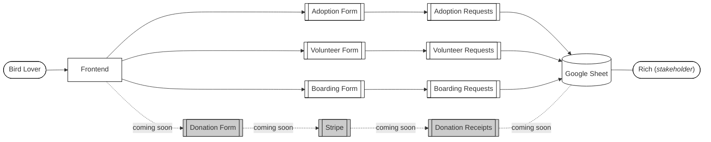

# rescuethebirds backend

 

## Project Overview

Welcome to our FastAPI backend! This repository contains the code for our backend server built using FastAPI, a modern, fast, web framework for building APIs with Python. This backend serves as the foundation for our application, allowing us to handle data processing and interactions.

## Features

- **FastAPI Framework**: Our backend is built using FastAPI, which provides a powerful and intuitive way to create APIs in Python.
- **Endpoint Documentation**: FastAPI automatically generates interactive API documentation. You can access it at `/docs` after running the server.
- **Annotations and Comments**: The code is well-annotated with comments to aid in understanding and maintenance.

## Prerequisites

Before you begin, make sure you have the following installed:

- Python 3.9+
- Pipenv (recommended for managing dependencies)

## Installation

1. Clone this repository: `git clone https://github.com/jae-finger/rescuethebirds`
2. Navigate to the project directory: `cd rescuethebirds`
3. Install dependencies: `pip install -r requirements.txt`

## Configuration

1. Create `.env`.
2. Configure database settings, API keys, and other environment-specific variables.

## Testing
Run `pytest -W ignore::DeprecationWarning`

## Running the Server

Run the following command to start the FastAPI development server:
1. `docker build -t rescuethebirds .`
2. `docker run -d -p 8000:8000 rescuethebirds`

## Basic Backend Flow
The Rescue the Birds! backend is built around assisting our stakeholder, Rich, at the refuge. He wishes to have a website that dumps everything into a google sheet - like the one he has now. So, here's a simplified view of how a user interacts with the frontend, and how it ends up in front of the refuge.

